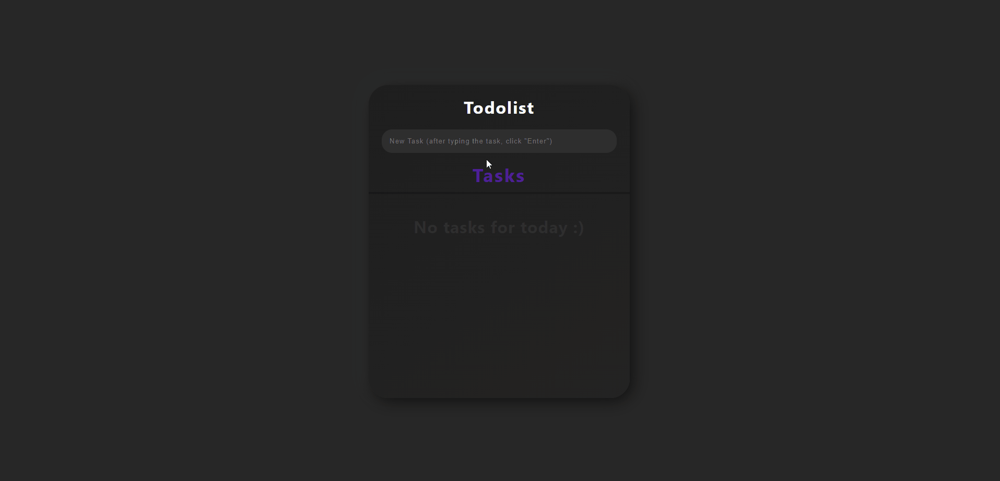
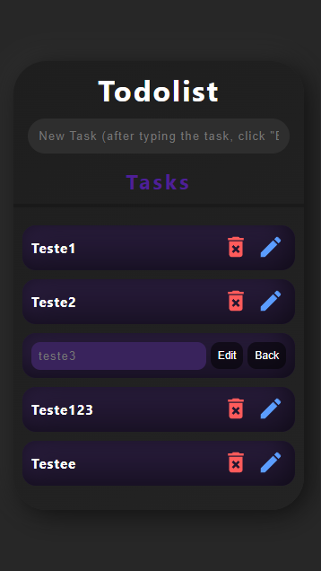

# TodolistApp - ReactJS

- ## Projeto foi feito para colocar em prática e testar as skills aprendidas com o ReactJS.

---

### É um TodoList padrão, você cria a tarefa e ela será salva no localStorage do seu navegador, você pode marcá-la como concluída, editá-la ou excluí-la, como você pode ver no GIF abaixo do sistema funcionando:

 

---
## Imagem da versão Mobile : 
 

## Teste você mesmo a aplicação, basta clicar [aqui](https://todolist-app-reactjs.netlify.app/), e irá ser redirecionado para o link do deploy no Netlify.

---

## Além das dependências padrão do "Create React App", foi utilizada:

- ## Material-UI: _mui/icons-material, emotion/react, emotion/styled, mui/icons-material, mui/material._
